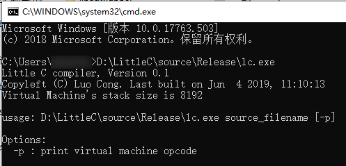

##### 说明
看雪大牛罗聪写的Little C编译器，词法和语法分析分别采用lex和yacc编写。定义了一套自己的bytecode，以及写了一个虚拟机（叫模拟器更准确）去执行它。 这是一份10年前的代码！！！

https://bbs.pediy.com/thread-149966.htm




##### 编译说明

从官网下载的flex编译不了，于是将flex和bison替换为win_flex和bison，编译通过。

https://sourceforge.net/projects/winflexbison/

运行mk.bat脚本，生成parse.c和scan.c。


##### WinFlexBison 

lex(flex)与yacc(bison)，lex与yacc是两个在Unix下的分别作词法分析和语法分析的工具，已被移植到win平台下。

https://github.com/lexxmark/winflexbison

[Win flex-bison 的简单使用](https://blog.csdn.net/gocad/article/details/21866627)

##### 自定义的虚拟机操作码VM_OPER

```C
typedef enum _OPCODE
{
    emOP_NOP = 0,
    emOP_SubSp,
    emOP_Hlt,
    emOP_Ret,
    emOP_Pop,
    emOP_Add_i,
    emOP_Sub_i,
    emOP_Mul_i,
    emOP_Div_i,
    emOP_Mod_i,
    emOP_Jmp,
    emOP_Je,
    emOP_Jne,
    emOP_Call,
    emOP_Libcall,
    emOP_Li_i,
    emOP_Libp_i,
    emOP_Ld_i,
    emOP_Ld_b,
    emOP_St_i,
    emOP_St_b,
    emOP_Libp_data,
    emOP_And_i,
    emOP_Xor_i,
    emOP_Or_i,
    emOP_Shl_i,
    emOP_Shr_i,
    emOP_Neg_i,
    emOP_Not_i,
    emOP_Cvt_b_i,
    emOP_Cvt_b_w,
    emOP_CmpEq_i,
    emOP_CmpNe_i,
    emOP_CmpLt_i,
    emOP_CmpGt_i,
    emOP_CmpLe_i,
    emOP_CmpGe_i,
    emOP_MAX_COUNT,
} OPCODE;

```

##### 虚拟机码对应的助记符

```c
static CONST OPER g_OperMap[] =
{
    { emOP_NOP,         "nop",      1 },
    { emOP_SubSp,       "subsp",    1 + sizeof_i },
    { emOP_Hlt,         "hlt",      1 },
    { emOP_Ret,         "ret",      1 },
    { emOP_Pop,         "pop",      1 },
    { emOP_Add_i,       "add_i",    1 },
    { emOP_Sub_i,       "sub_i",    1 },
    { emOP_Mul_i,       "mul_i",    1 },
    { emOP_Div_i,       "div_i",    1 },
    { emOP_Mod_i,       "mod_i",    1 },
    { emOP_Jmp,         "jmp",      1 + sizeof_i },
    { emOP_Je,          "je",       1 + sizeof_i },
    { emOP_Jne,         "jne",      1 + sizeof_i },
    { emOP_Call,        "call",     1 + sizeof_i },
    { emOP_Libcall,     "libcall",  1 + sizeof_i },
    { emOP_Li_i,        "li_i",     1 + sizeof_i },
    { emOP_Libp_i,      "libp_i",   1 + sizeof_i },
    { emOP_Ld_i,        "ld_i",     1 },
    { emOP_Ld_b,        "ld_b",     1 },
    { emOP_St_i,        "st_i",     1 },
    { emOP_St_b,        "st_b",     1 },
    { emOP_Libp_data,   "libp_data",1 },
    { emOP_And_i,       "and_i",    1 },
    { emOP_Xor_i,       "xor_i",    1 },
    { emOP_Or_i,        "or_i",     1 },
    { emOP_Shl_i,       "shl_i",    1 },
    { emOP_Shr_i,       "shr_i",    1 },
    { emOP_Neg_i,       "neg_i",    1 },
    { emOP_Not_i,       "not_i",    1 },
    { emOP_Cvt_b_i,     "cvt_b_i",  1 },
    { emOP_Cvt_b_w,     "cvt_b_w",  1 },
    { emOP_CmpEq_i,     "cmpeq_i",  1 },
    { emOP_CmpNe_i,     "cmpne_i",  1 },
    { emOP_CmpLt_i,     "cmplt_i",  1 },
    { emOP_CmpGt_i,     "cmpgt_i",  1 },
    { emOP_CmpLe_i,     "cmple_i",  1 },
    { emOP_CmpGe_i,     "cmpge_i",  1 },
};
```

##### 在虚拟机中运行代码

```c
VM_STATUS VM_Interpret(
    CONST INT nCodeSize,  CONST PBYTE pbyCode,
    CONST INT nDataSize,  CONST PBYTE pbyData,
    CONST INT nStackSize, INT pStack[]
)
{
    VM_STATUS VMStatus;
    PINT sp;
    PINT bp;
    INT pc;
    BYTE f;
    INT a;
    INT b;

#ifndef get_a
#define get_a() *(INT *)&pbyCode[pc], pc += sizeof_i
#endif

    if (FALSE == VM_CheckCodeValid(nCodeSize, pbyCode))
    {
        VM_Printf("-----\nVM code checking not valid.");
        VM_Abort(&VMStatus);
        return VMStatus;
    }

    // VM initialize
    pc = 0;
    VMStatus = emVS_Running;
    bp = sp = pStack + nStackSize;

    while (emVS_Running == VMStatus)
    {
        if (sp - pStack < 0)
        {
            VM_Error(emVEI_Runtime_Error_Stack_Overflow);
            VM_Abort(&VMStatus);
            continue;
        }

        f = pbyCode[pc++];

        switch (f)
        {
        case emOP_NOP:
            break;

        case emOP_Pop:
            ++sp;
            break;

        case emOP_SubSp:
            a = get_a();
            sp = (PINT)((INT)sp - a);
            break;

        case emOP_Hlt:
            VMStatus = emVS_Halt;
            break;

        case emOP_Add_i:
            ++sp;
            sp[0] += sp[-1];
            break;

        case emOP_Sub_i:
            ++sp;
            sp[0] -= sp[-1];
            break;

        case emOP_Mul_i:
            ++sp;
            sp[0] *= sp[-1];
            break;

        case emOP_Div_i:
            ++sp;
            if (0 == sp[-1])
            {
                VM_Error(emVEI_Runtime_Error_Divided_By_Zero);
                VM_Abort(&VMStatus);
                continue;
            }
            sp[0] /= sp[-1];
            break;

        case emOP_Mod_i:
            ++sp;
            if (0 == sp[-1])
            {
                VM_Error(emVEI_Runtime_Error_Divided_By_Zero);
                VM_Abort(&VMStatus);
                continue;
            }
            sp[0] %= sp[-1];
            break;

        case emOP_And_i:
            ++sp;
            sp[0] &= sp[-1];
            break;

        case emOP_Xor_i:
            ++sp;
            sp[0] ^= sp[-1];
            break;

        case emOP_Or_i:
            ++sp;
            sp[0] |= sp[-1];
            break;

        case emOP_Shl_i:
            ++sp;
            sp[0] <<= sp[-1];
            break;

        case emOP_Shr_i:
            ++sp;
            sp[0] >>= sp[-1];
            break;

        case emOP_Neg_i:
            sp[0] = -sp[0];
            break;

        case emOP_Not_i:
            sp[0] = ~sp[0];
            break;

        case emOP_Cvt_b_i:
            sp[0] = (CHAR)sp[0];
            break;

        case emOP_Cvt_b_w:
            sp[0] = (SHORT)sp[0];
            break;

        case emOP_CmpEq_i:
            ++sp;
            sp[0] = sp[0] == sp[-1];
            break;

        case emOP_CmpNe_i:
            ++sp;
            sp[0] = sp[0] != sp[-1];
            break;

        case emOP_CmpLt_i:
            ++sp;
            sp[0] = sp[0] < sp[-1];
            break;

        case emOP_CmpGt_i:
            ++sp;
            sp[0] = sp[0] > sp[-1];
            break;

        case emOP_CmpLe_i:
            ++sp;
            sp[0] = sp[0] <= sp[-1];
            break;

        case emOP_CmpGe_i:
            ++sp;
            sp[0] = sp[0] >= sp[-1];
            break;

        case emOP_Jmp:
            a = get_a();
            pc = a;
            break;

        case emOP_Je:
            a = get_a();
            if (sp[0] == 0)
                pc = a;
            ++sp;
            break;

        case emOP_Jne:
            a = get_a();
            if (sp[0] != 0)
                pc = a;
            ++sp;
            break;

        case emOP_Libcall:
            a = get_a();        // function index
            --sp;
            LibCall(bp, sp, a);
            b = sp[0];          // return value
            ++sp;
            sp[0] = b;          // return value
            break;

        case emOP_Call:
            b = sp[0];          // li_i XXXXXXXX, means function's offset
            a = get_a();        // get param-size
            Push_i(pc);         // return pc
            Push_i((INT)bp);    // bp
            Push_i(a);          // param-size
            bp = sp;            // mov ebp, esp
            pc = b;             // set pc to new position
            break;

        case emOP_Ret:
            a = sp[0];          // return value
            sp = bp;            // mov esp, ebp
            b = Pop_i();        // param-size
            bp = (PINT)Pop_i(); // pop ebp
            pc = Pop_i();       // restore return position
            sp = (PINT)((INT)sp + b);   // eat up param's space
            sp[0] = a;          // return value
            break;

        case emOP_Li_i:
            a = get_a();
            Push_i(a);
            break;

        case emOP_Libp_i:
            a = get_a();
            Push_i((INT)bp - a);
            break;

        case emOP_Ld_i:
            sp[0] = *((INT *)sp[0]);
            break;

        case emOP_Ld_b:
            sp[0] = *((CHAR *)sp[0]);
            break;

        case emOP_St_i:
            *((INT *)sp[0]) = sp[1];
            ++sp;
            break;

        case emOP_St_b:
            *((BYTE *)sp[0]) = sp[1] & 0xff;
            ++sp;
            break;

        case emOP_Libp_data:
            sp[0] = (INT)&pbyData[sp[0]];
            break;

        default:
            break;
        } // switch
    } // while

    return VMStatus;
}
```

##### [lib.c](source/src/lib.c)
lib.c中定义了作者实现的虚拟机函数。

```c++
//
// Lib-call define
//
typedef enum _LIB_CALL_INDEX
{
    emLCI_printnum = 0,
    emLCI_printstr,
    emLCI_strcpy,
    emLCI_strcat,
    emLCI_strlen,
    emLCI_DeleteFile,
    emLCI_MAX_COUNT,
} LIB_CALL_INDEX;

```


##### 其他资料

编译原理

《lex和yacc从入门到精通》

flex: the fast lexical analyser

##### 应用

程序的关键算法的加密保护，增加破解难度。


